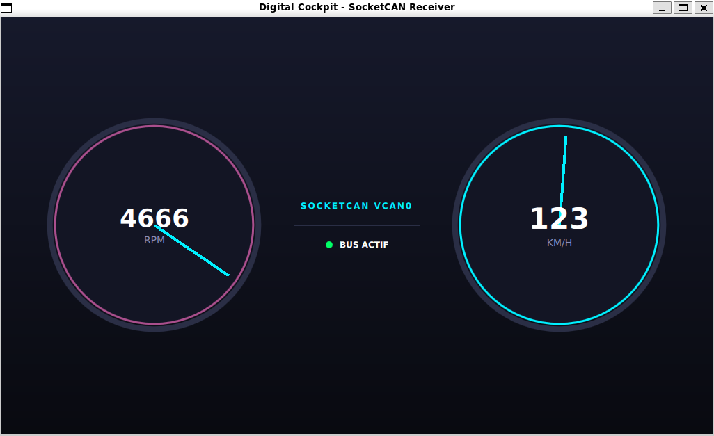

# Cockpit Numérique Automobile & Simulateur Bus CAN

Application de tableau de bord automobile en temps réel développée en **C++17** et **Qt6/QML**, connectée à un bus **SocketCAN** sous Linux.

Le projet simule le fonctionnement d'un combiné d'instruments lisant la télémétrie d'un véhicule (vitesse, régime moteur, températures, voyants) diffusée sur une interface réseau CAN virtuelle.

 *(Ajoute une capture d'écran une fois l'interface prête)*

---

## 🚀 Fonctionnalités Clés

- **Traitement Temps Réel :** Réception et découpage des trames CAN haute fréquence sans bloquer le rendu graphique.
- **Architecture Découplée :** Séparation stricte entre le moteur de simulation (C++ / SocketCAN) et la couche d'affichage (Qt Quick / QML).
- **Intégration Linux Native :** Exploitation directe des sockets du noyau Linux (`vcan0`) via l'API SocketCAN.
- **Interface Moderne :** Rendu fluide à 60 FPS avec indicateurs de vitesse, compte-tours et témoins d'alerte.

---

## 🛠️ Stack Technique

- **Langage :** C++17, QML (Qt Quick)
- **Framework IHM :** Qt 6 (Core, Gui, Quick, Qml)
- **Système & IPC :** Linux SocketCAN, POSIX Sockets, Multithreading (`std::thread`, `QThread`)
- **Build & Outillage :** CMake, `can-utils`, GCC / GDB
- **Environnement :** Linux (Debian / Ubuntu / WSL2)

---

## 🏗️ Architecture du Projet

```text
car-dashboard/
├── CMakeLists.txt        # Configuration de compilation CMake
├── README.md             # Documentation du projet
├── docs/                 # Captures d'écran et schémas d'architecture
└── src/
    ├── main.cpp          # Point d'entrée de l'application Qt
    ├── can_receiver.cpp  # Lecture asynchrone des trames CAN sur vcan0
    └── simulator.cpp     # Générateur de télémétrie véhicule (Backend)
```

## ⚙️ Compilation et Exécution

### 1. Prérequis

Sur un système basé sur Debian ou Ubuntu (nativement ou sous WSL2) :
```bash
sudo apt update
sudo apt install -y build-essential cmake qt6-base-dev qt6-declarative-dev can-utils
```
### 2. Configuration du bus CAN virtuel (`vcan0`)

```bash
# Charger le module noyau vcan
sudo modprobe vcan

# Créer et activer l'interface virtuelle
sudo ip link add dev vcan0 type vcan
sudo ip link set up vcan0
```

### 3. Compilation du projet

```bash
# Création du dossier de build
mkdir build && cd build

# Compilation avec CMake
cmake ..
make
```

### 4. Lancement

```bash
./CarDashboard_app
```

## 🧪 Tester avec le bus CAN

Pour envoyer manuellement une trame CAN de test sur l'interface `vcan0` et vérifier la réaction du tableau de bord :

```bash
# Exemple : Envoi d'une trame avec l'ID 0x123
cansend vcan0 123#1122334455667788
```
### Injection dynamique via le script Python

Un script d'accélération progressive est fourni sous `scripts/simulate_car.py` :

```bash
python3 scripts/simulate_car.py
```

## ✒️ Auteur

- **GitHub :** @amorirReverse
- **Projet :** Portfolio Développeur C++ / Linux Embarqué